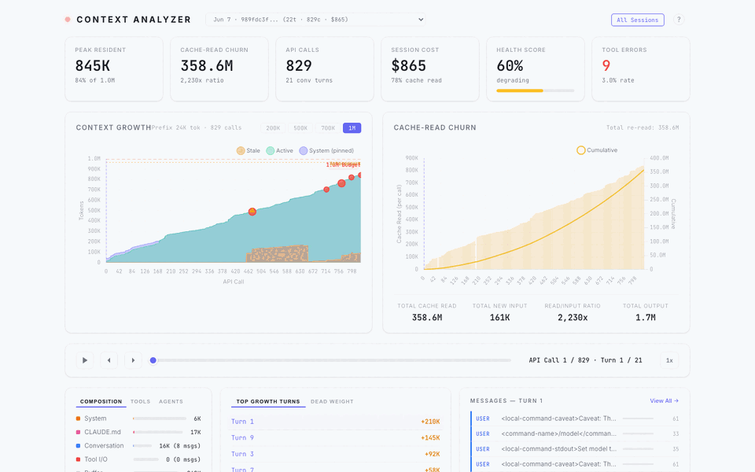
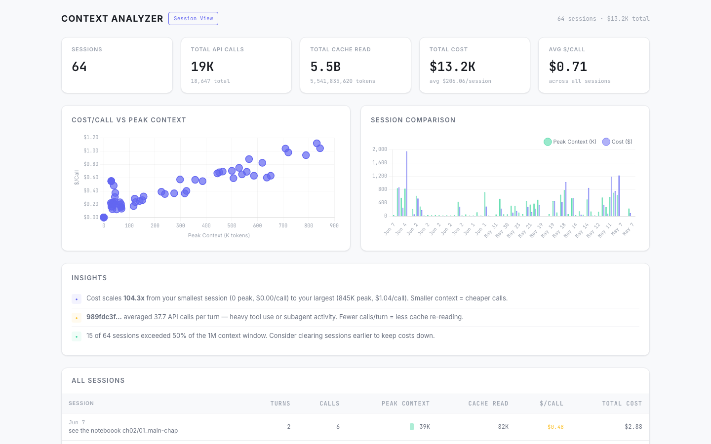
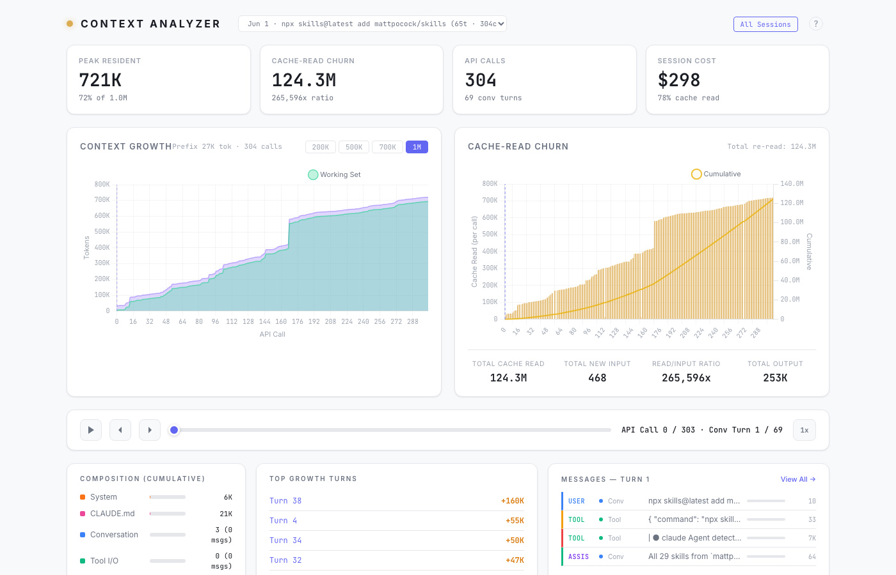
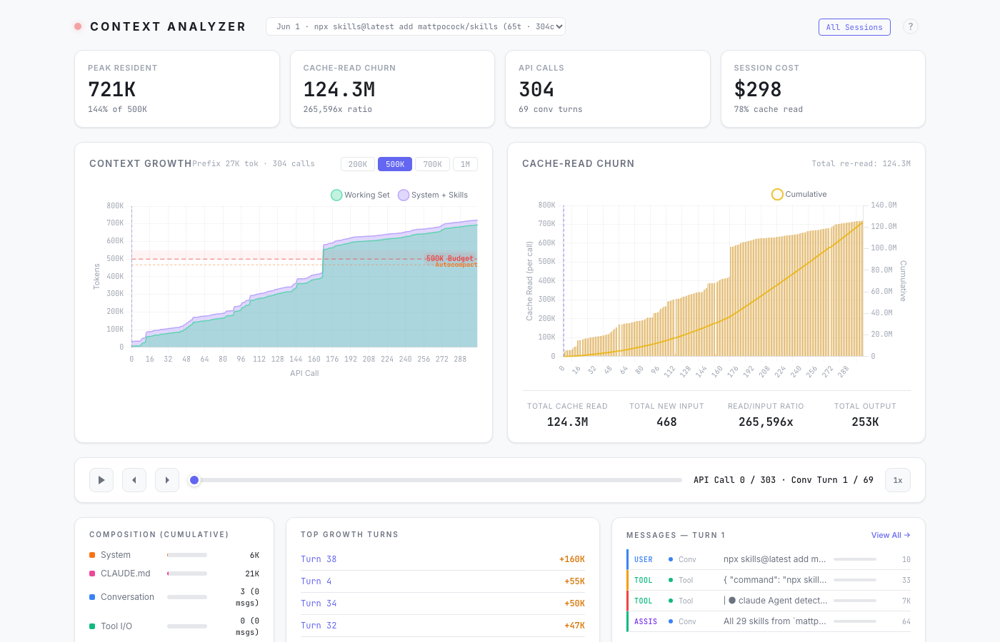
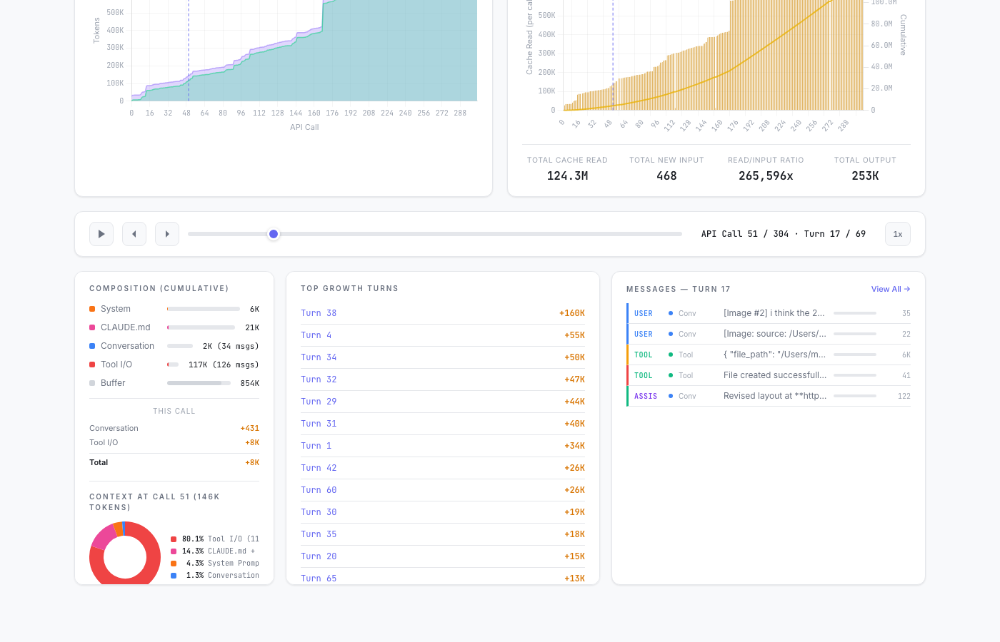
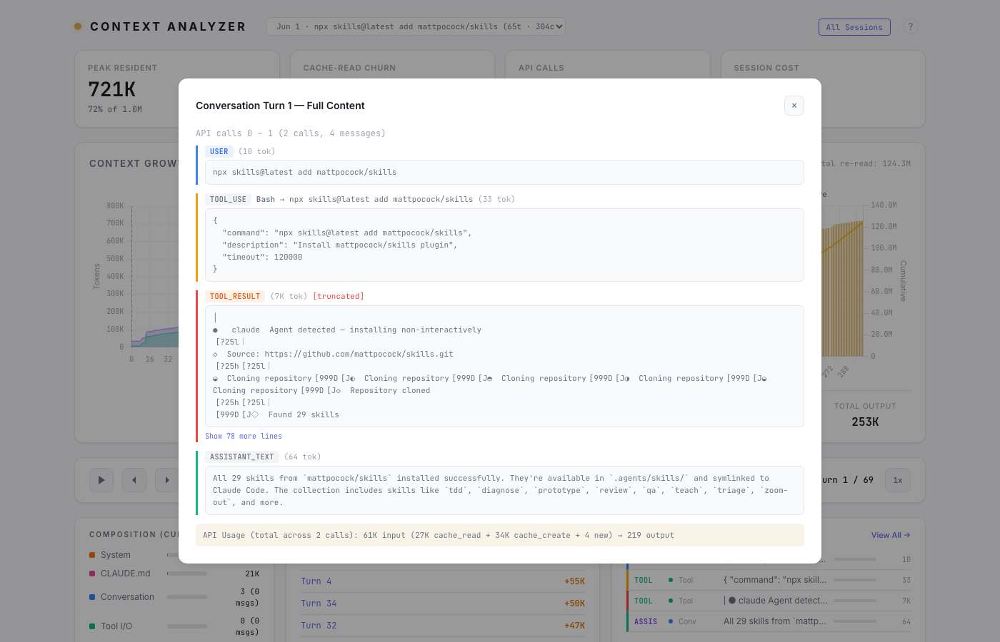

<div align="center">

# Context Analyzer

Context window forensics for AI coding agents.

**See exactly where your tokens go — per call, per turn, per session · dashboard · MCP server · Claude Code + Codex.**

[](https://github.com/manavgup/context-analyzer/actions/workflows/ci.yml) [](LICENSE) [](https://www.python.org/downloads/)
<!-- PyPI badge — enable with the first `context-tracker` publish (#77/#85); it 404s until then:
[](https://pypi.org/project/context-tracker/)
-->

[Quick Start](#quick-start) · [Proof](#proof) · [What it does](#what-it-does) · [Architecture](#architecture) · [Issues](https://github.com/manavgup/context-analyzer/issues)

<sub>AI agents / LLMs: read <a href="./llms.txt">/llms.txt</a></sub>

</div>

---

**Your Claude Code calls cost 4.3x more at large context than at small context — $0.23/call at 63K tokens vs $0.98/call at 721K.** Context Analyzer shows you exactly where that money goes, per call, per turn, per session.

Measured across real sessions:

- **Cost per API call scales 4.3x** from small to large context (63K peak = $0.23/call vs 721K peak = $0.98/call)
- **30% of context becomes stale dead weight** within 5 turns — you keep paying for it anyway
- **Tool I/O consumes 60%+ of used context** — most of your window isn't conversation
- **Sessions past 50% of the 1M window drive disproportionate cost** — the last half of a long session is the expensive half
- **Cache hit rate is 96–98%** when the system prompt prefix stays stable — and every prefix change costs you a cold re-read



## Quick Start

```bash
uv tool install context-tracker    # or: pip install context-tracker
context-tracker up
```

`context-tracker up` installs the Claude Code hooks (backed up, reversible), ingests your existing transcripts, and opens the dashboard. You'll see data from your past sessions immediately — the hooks only add live capture going forward. Undo everything with `context-tracker down`.

Then open:

- `http://localhost:8080/` — single-session dashboard
- `http://localhost:8080/sessions` — cross-session analytics

## Proof

### Cost scales with context — see it across sessions

The `/sessions` page plots cost/call against peak context for every session. This is where the 4.3x scaling shows up: the same kind of API call costs $0.23 at 63K peak context and $0.98 at 721K.



### Watch a session get expensive in real time

The single-session dashboard shows context growth call by call. The steeper the curve, the faster each subsequent call gets more expensive — you can pinpoint the exact turn where a session tipped into the costly zone.



### Know when you've crossed your budget

Toggle budget thresholds (200K / 500K / 700K / 1M) to see where usage exceeds your target. The dashed red line is your budget, the orange dotted line is where Claude Code auto-compacts, and the red shading is the zone where sessions drive disproportionate cost.



### See what you're actually paying for

The composition panel breaks down every call into Tool I/O vs Conversation vs System prefix, using API-reported token counts as ground truth. This is where the 60%+ Tool I/O finding comes from — most of your bill is tool output, not dialogue.



### Find the dead weight

The message inspector shows the full content of every turn — user prompts, tool calls, tool results, assistant responses. This is how you find the 30% of context that went stale 5 turns ago but is still riding along in every call.



### Reproduce the headroom ceiling audit on your own sessions

Don't take our number — run the [retrospective compression audit](experiments/headroom/RETROSPECTIVE-RESULTS.md) on your own transcripts. One command, fully offline, zero API spend; it builds a scratch corpus from `~/.claude/projects/` (never touching your live analyzer DB) and reports the maximum headroom's compressors could have saved on your workload:

```bash
pip install --no-deps headroom-ai==0.32.1 && pip install tiktoken
context-tracker audit-headroom
```

The headline (ceiling % and $) prints to your terminal and the full report lands in `./headroom-ceiling-report.md` — numbers only, no prompt content.

## What it does

- **Hooks** into Claude Code via `~/.claude/settings.json` to capture tool calls, compaction events, session lifecycle, and subagent activity
- **Parses transcripts** for exact API token usage (input, output, cache_read, cache_creation) — API-reported numbers, not estimates
- **Ingests Codex CLI sessions** from `~/.codex/sessions/` rollout logs — Codex sessions appear in the same dashboard and analytics alongside Claude Code (API-level token forensics; compaction/subagent depth remains Claude Code-only)
- **SQLite persistence** stores session data for fast queries and cross-session analysis
- **Dashboard** at `/` for single-session visualization: context growth, cache churn, composition, message inspector
- **Cross-session analytics** at `/sessions` for comparing patterns across sessions: cost/call vs context size, insights, trends

## Dashboard Features

**Single-session view** (`/`)

- Context Growth chart with budget line, danger band, and autocompact threshold
- Budget toggle buttons (200K / 500K / 700K / 1M)
- Cache-Read Churn chart showing per-call re-read cost
- Session dropdown to switch between sessions without restarting
- Message inspector with collapsible content blocks
- Token breakdown donut chart (Tool I/O vs Conversation vs System) — updates per-turn
- Composition breakdown with API-reported token counts
- Top growth turns, scrubber with playback

**Cross-session analytics** (`/sessions`)

- Summary cards: total sessions, API calls, cache read, cost, avg $/call
- Cost/Call vs Peak Context scatter plot
- Session comparison bar chart
- Auto-generated insights (cost patterns, expensive sessions, efficiency metrics)
- Sortable session table with $/call color coding
- Click any session to drill into its single-session view

## Architecture

```
Claude Code Hooks (shell commands)
  ├── PostToolUse, PostToolUseFailure
  ├── PreCompact, PostCompact
  ├── SessionStart, SessionEnd
  ├── UserPromptSubmit
  ├── SubagentStart, SubagentStop
  └── InstructionsLoaded
       │
       ▼
  ~/.claude/context-trace/<session_id>.jsonl  (hook events)
  ~/.claude/projects/<project>/<session_id>.jsonl  (transcripts)
       │
       ▼
  SQLite (auto-ingest on first access)
  ├── sessions       — summary stats, cost, model
  ├── api_calls      — per-call token breakdown
  ├── blocks         — content blocks with enter/exit turns
  ├── turns          — conversation turn mapping
  ├── hook_events    — tool calls, failures, lifecycle
  ├── subagents      — agent summaries
  ├── subagent_api_calls — per-call churn for each subagent
  └── tool_result_offloads — offloaded tool outputs
       │
       ▼
  FastAPI Dashboard + MCP Server
  ├── /              — single-session dashboard
  ├── /sessions      — cross-session analytics
  ├── /api/sessions  — session list with stats
  ├── /api/sessions/trends — cross-session aggregation
  └── /api/session/{id}/data — full session data (blocks + churn)
```

## Upgrading

After upgrading context-tracker, re-run `context-tracker up` to refresh the
Claude Code hooks in `~/.claude/settings.json`. The installer is idempotent,
backs up your settings first, and leaves any other hooks you have configured
untouched. See [CHANGELOG.md](CHANGELOG.md) for details.

## Development

Contributor setup runs from a clone instead of the installed package:

```bash
git clone https://github.com/manavgup/context-analyzer.git
cd context-analyzer
make install-dev       # create venv and install with uv
make hook-install      # install Claude Code hooks (optional — dashboard works without hooks)
make dev               # start dashboard on localhost:8080
```

Prerequisites: Python 3.11+, [uv](https://docs.astral.sh/uv/), make, git.

```bash
make help          # see all available targets
make dev           # start dashboard dev server with reload
make lint          # run linter
make format        # format code
make typecheck     # run mypy
make coverage      # run tests with coverage
make verify        # run full verification suite (lint + format + typecheck + test)
```

## License

MIT
